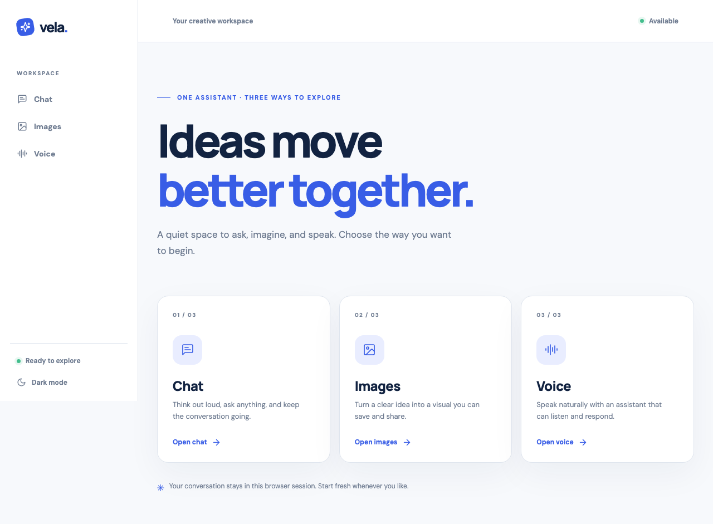
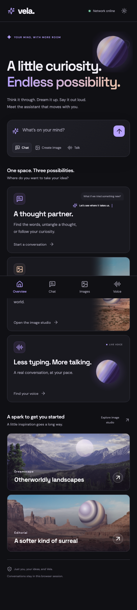

# Vela

An AI workspace for streaming chat, image generation, and live voice conversations.
Built with React, TypeScript, and Cloudflare Workers, with an alternative FastAPI deployment.

**[Open Vela](https://vela-assistant.dakshx.workers.dev)** · **[Review the UI preview](https://pr-3-vela-preview.dakshx.workers.dev)**



<details>
<summary>Mobile screenshot</summary>



</details>

## Features

| Feature | Behavior |
| --- | --- |
| Chat | Multi-turn streaming, Markdown, code copying, retry, and new conversations |
| Images | Prompt suggestions, generation, preview, regeneration, and download |
| Voice | LiveKit audio, microphone permission checks, connection states, and transcripts |
| Appearance | Lilac-and-peach dark and light modes with responsive navigation |
| Privacy | Provider credentials stay on the backend; conversations remain in browser memory |

The review preview uses demo chat and image responses. Live voice sessions require the production site.

## Quick start

### Docker

Requires Docker with Compose.

```bash
cp .env.example .env
# Set CALLMISSED_API_KEY in .env.
docker compose up --build
```

Open **http://localhost:8080**. The interface loads with the placeholder key;
AI requests need a valid CallMissed key with `llm`, `image`, `stt`, and `tts` permissions.

### Local development

Requires Node.js 22, npm, Python 3.12–3.14, and Make.

```bash
cp .env.example .env
make setup
```

Run these commands in separate terminals:

```bash
make dev-api
```

```bash
make dev-web
```

Open **http://localhost:5173**. Development API documentation is at
**http://localhost:8000/docs**. Deployed voice calls require HTTPS and microphone permission.

## Build and checks

Run commands from the repository root.

| Command | Purpose |
| --- | --- |
| `make build` | Install missing dependencies and build frontend and edge outputs in parallel |
| `make build-force` | Rebuild using installed dependencies |
| `make build-check` | Build and validate Cloudflare packaging |
| `make test` | Run backend, frontend, and edge tests |
| `make lint` | Run Python lint/types, ESLint, and TypeScript checks |
| `make compose-check` | Validate Docker Compose configuration |
| `make deploy-cloudflare` | Build, validate, and deploy the production Worker |

Unchanged local builds reuse verified output. Markdown and LiveKit load when needed,
and fonts are served locally. See [build details](docs/build.md).

## Deploy to Cloudflare

The production Worker is **`vela-assistant`** and serves both the UI and the API.
Its configuration is [edge/wrangler.jsonc](edge/wrangler.jsonc).

```bash
make build-check
cd edge
npx wrangler login
# First-time setup only: enter the provider key at Wrangler's private prompt.
npx wrangler secret put CALLMISSED_API_KEY
cd ..
make deploy-cloudflare
```

Existing deployments retain their stored secret. Verify deployment with:

```bash
curl -fsS https://vela-assistant.dakshx.workers.dev/api/v1/health/ready
```

Cloudflare builds previews through its direct GitHub connection; GitHub Actions
runs CI and publishes verified preview links without Cloudflare credentials. For dashboard commands or Docker hosting, see
[the deployment guide](docs/deployment.md). Review URLs use a separate demo Worker;
merging a PR changes only its target branch. Production builds must use the branch
that contains the desired changes.

## Repository layout

```text
web/       React interface and browser tests
edge/      Cloudflare Worker, Node adapter, and edge tests
api/       FastAPI backend and tests
infra/     Caddy, Prometheus, and Grafana configuration
scripts/   Build and browser verification utilities
docs/      Setup, deployment, architecture, and design guides
```

## Documentation

- [Deployment guide](docs/deployment.md): production, direct GitHub integration, and Docker hosting.
- [Build guide](docs/build.md): caching, CI commands, and loading optimizations.
- [PR previews](docs/pr-previews.md): setup, review URLs, and demo behavior.
- [Architecture and API](docs/architecture.md): request flows, routes, security, and monitoring.
- [UI design](docs/ui-design.md): workspace layout, visual direction, and references.

## Verification

Automated tests use mocked provider responses and do not spend API credits.
Browser checks cover navigation, chat streaming, image display/download, and dark/light
appearances on desktop and mobile. Production deployment checks cover the deployed UI
and health endpoints. Real microphone input and audible agent responses still need a
human device check; automated UI checks do not establish voice audio quality.
