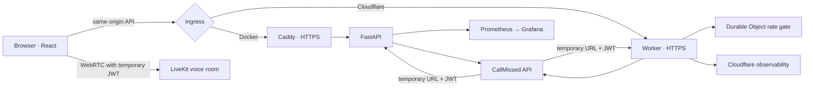
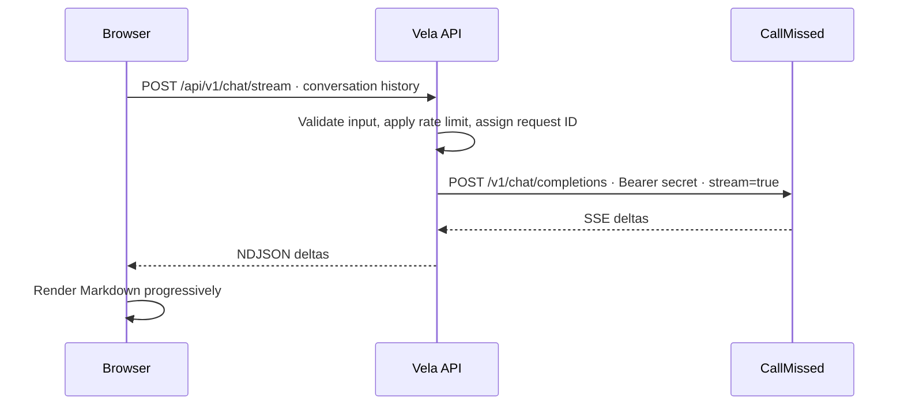
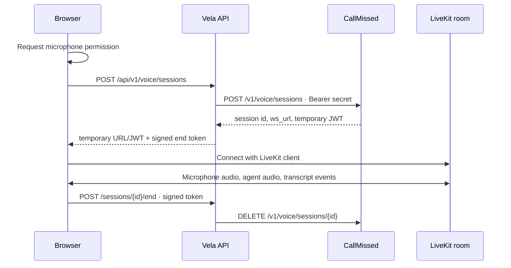

# Architecture and API reference

[Back to README](../README.md) · [Deployment](deployment.md)

## System overview



The default production target is **Cloudflare Workers with static assets**, which gives HTTPS and a same-origin API on a low-cost host. The **Docker Compose deployment** is an independent, production-style container path using FastAPI and Caddy, suitable for EC2 or a VM. Both backends implement the same `/api/v1` contract and are tested against mocked CallMissed responses. The two provider adapters are a deliberate deployment trade-off; parity tests and a shared contract should be expanded if both targets remain long term.

### Chat request



### Voice session



## Product behavior

- **Chat:** streaming multi-turn responses, Markdown with code copy, retry, new conversation, keyboard controls, natural scroll, and interruption handling. Messages remain in React memory. The only browser storage is the appearance preference.
- **Images:** one image per request, bounded prompt length, explicit generating state, preview, regenerate, and download. Image bytes are returned by the API and kept only in browser memory.
- **Voice:** server-created temporary LiveKit credential; microphone preflight before paid session creation; connection, listening, thinking, speaking, reconnecting, and error states; transcript lines only from LiveKit events; audio cleanup and remote session deletion on end. The server caps sessions at five minutes by default.

CallMissed's [chat](https://docs.callmissed.com/docs/chat-completion), [image](https://docs.callmissed.com/docs/image-generation), and [voice session](https://docs.callmissed.com/docs/voice-sessions-api) contracts drive the integration. Defaults are `sarvam-105b-conversations`, `sdxl-lightning`, and the CallMissed voice stack with `shubh` and `en-IN`. Override model and voice settings through server configuration, not browser controls.

## API

| Route | Purpose |
| --- | --- |
| `GET /api/v1/health/live` | Process liveness, no provider dependency |
| `GET /api/v1/health/ready` | Configuration readiness |
| `POST /api/v1/chat` | Complete chat response |
| `POST /api/v1/chat/stream` | NDJSON chat stream |
| `POST /api/v1/images` | One base64 image |
| `POST /api/v1/voice/sessions` | Create temporary voice credentials |
| `POST /api/v1/voice/sessions/{id}/end` | End the remote session |
| `POST /api/v1/voice/sessions/{id}/transcript` | Fetch recorded turns |

Requests have bounded bodies and typed validation. Failures use `{ "error": { "code", "message", "request_id" } }`. User-facing messages never include raw provider errors. The request ID is also returned in `X-Request-ID`.

## Security and privacy

- `CALLMISSED_API_KEY` is read only by a backend runtime. The browser receives a temporarily issued voice JWT and URL, never the permanent key. Cloudflare uses an encrypted Worker secret; Docker injects `.env` at runtime. `.env`, `.dev.vars`, dependencies, and builds are ignored by Git and Docker contexts.
- Production FastAPI rejects a missing/placeholder key, HTTP public URL, wildcard/localhost CORS, or non-HTTPS provider URL. Cloudflare uses same-origin requests and issues no cross-origin allowance.
- Input caps: 30 chat turns, 8,000 characters per message, 30,000 total characters, 2,000 image-prompt characters, one image per request, and a five-minute voice session. Rate limits protect chat, image, and voice creation. Docker uses one-process sliding windows; Cloudflare uses a per-client Durable Object for cross-isolate limits.
- The provider client bounds concurrency and timeouts. It does **not** automatically retry paid image generations or session creation. A client retry is explicit, avoiding surprise duplicate charges.
- Caddy and Cloudflare static assets set CSP, frame protection, MIME protection, referrer and microphone policies. Caddy adds HSTS on HTTPS deployments. CSP permits dynamic `wss:` endpoints because LiveKit's room URL is issued per session.
- Logs record status, route, latency, operation, and request ID. Prompts, transcripts, audio, Authorization headers, and secret values are excluded. The UI stores only the theme preference locally.
- The app has no accounts or database: the assignment does not require durable identity, and avoiding persistence reduces privacy and operations burden. A public deployment needs a provider budget cap and should be treated as a cost-bearing service.

## Observability

FastAPI exposes Prometheus data at `/internal/metrics` on the internal Compose network; Caddy returns 404 for `/internal/*`. Metrics include route and status counts, HTTP latency, provider operation counts, failure category, and operation latency. Labels exclude prompts, request IDs, session IDs, and IP addresses. Optional monitoring:

```bash
GRAFANA_ADMIN_PASSWORD='choose-a-strong-password' docker compose -f compose.yaml -f compose.monitoring.yaml up --build -d
```

Grafana is bound to `127.0.0.1:3000` and provisions `infra/grafana/dashboards/vela.json`. On Cloudflare, Workers Observability records structured request events; Durable Objects enforce distributed rate limits. Cloudflare's dashboard provides edge request and error charts. The container dashboard does not automatically aggregate Cloudflare metrics.

## Quality gates

```bash
make test          # Backend and frontend tests
make lint          # Ruff, mypy, ESLint, TypeScript
make build         # Cached frontend + edge build in parallel
make build-force   # Rebuild both outputs
make build-check   # Build + Cloudflare packaging validation
make compose-check # Compose validation
```

`edge/` has its own `npm test`, `npm run typecheck`, `npm run build`, and `npm run dry-run`. Tests mock the provider and never spend API credits. GitHub Actions runs all tests, static analysis, production builds, Docker Compose smoke checks, secret scanning, and filesystem vulnerability scanning. Production dependency audits run for both JavaScript packages.

The browser test suite covers chat streaming, image output, and microphone denial. An optional Playwright smoke (`python scripts/browser_smoke.py http://localhost:5173`) checks real desktop/mobile navigation against clearly mocked API responses. Real WebRTC, real CallMissed output, and browser audio playback require a valid key and manual device testing; the CI suite does not pretend to verify them.

## Engineering trade-offs

The project deliberately avoids a database, login flow, queue, and automatic retries for paid operations. The Cloudflare and FastAPI adapters duplicate a small amount of provider mapping to support both serverless and container deployment; their request/response contract and failure tests are kept aligned. For a long-lived product, consolidate on one target or extract a shared contract test suite. Next improvements would be authenticated user budgets, a durable conversation store with retention controls, provider webhook validation for voice completion, and a real-device WebRTC browser test in a dedicated environment.
